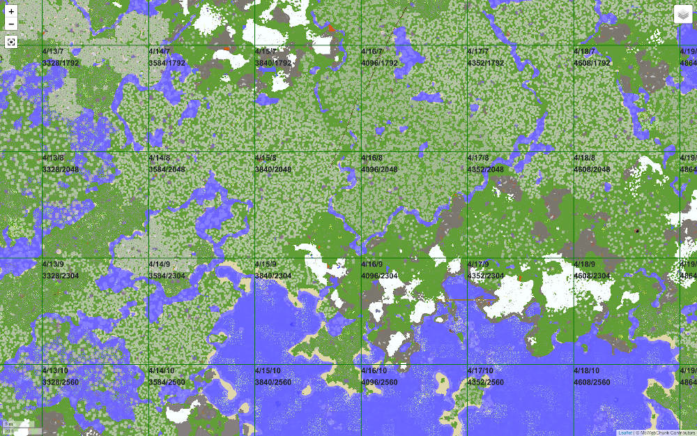

WebChunk is a simple web server written in Go that works with Postgres datbase to store and render chunks from Minecraft to your browser.

It is mainly targeted at multiplayer anarchy servers because of "hacking" being a bold word that fits literally every game modification.

Designed to accept chunks from multiple players at once, provide very fast deserialization and storage and mapping information.

## Features

- [x] Colored view
- [x] Heightmap view
- [x] Accepting compressed chunks
- [x] Caching
- [x] Portals/chests overlay
- [x] Colors customization
- [x] Concurrent use
- [x] Connect and view downloaded chunks in-game
- [x] Biome view

### In plans

#### By priority (from highest to lowest)

- [ ] Pre-render of areas
- [ ] Map markers
- [ ] Restore chunks to level and make it downloadable (backup restore)
- [ ] 3D view
- [ ] Customizable overlaying
- [ ] Mobile version
- [ ] Block formation search
- [ ] Heatmap of terrain difference
- [ ] Player activity search
- [ ] "New chunks" overlay

#### By ease of implementation (from easiest to hardest)

- [ ] Block formation search
- [ ] "New chunks" overlay
- [ ] Map markers
- [ ] Heatmap of terrain difference
- [ ] Player activity search
- [ ] Pre-render of areas
- [ ] Customizable overlaying
- [ ] Restore chunks to level and make it downloadable (backup restore)
- [ ] Mobile version
- [ ] 3D view

## Data source

Currently storage interface operates with anvil chunk format that can be grabbed from both region files and game itself. Storing multiple versions of same chunk is also permitted and viewed as a feature that can be further supported and used to analyze how terrain/world changed, potentially converting whole thing into data analysis framework.

## Storage

WebChunk currently supports storing data in PostgreSQL database, empty template of schemas are located in `db/sql/init/init.sh`. Work has been put into making storage interfacing not complex and as easy to implemet as possible, although it supports multiple worlds (or "servers" as I call them) it is not mandatory to provide multi-world functionality or even more than one dimension.

## How does it work?

Upon deploying WebChunk to a server or starting it locally it will accept NBT serialized chunk information over HTTP endpoint and store it in attached Postgres database, this is basically it! Front page has a Leaflet map that requests images from WebChunk and displays them nicely and organized.

## Security and safety of the data

WebChunk is built to provide service to owner of the database and web server. It does not feature any user profiles, access rights or any other means of stopping other people from communicating with service. That directly means that you (owner of WebChunk deployment) in charge of regulating who can access resource. WebChunk may also have unknown vulnerabilities that can allow other people to gain unwanted access.

## License

### GNU Affero General Public License v3.0

See file `LICENSE` in the project root
