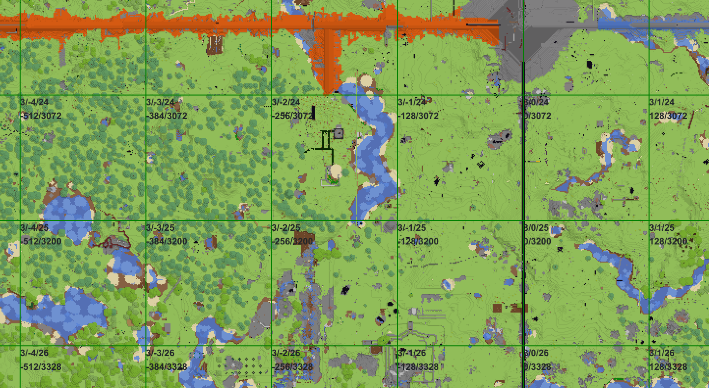

# WebChunk

Dynmap for players

WebChunk is a simple web server written in Go that works with Postgres datbase to store and render chunks from Minecraft to your browser.

It is mainly targeted at multiplayer anarchy servers because of "hacking" being a bold word that fits literally every game modification.

Designed to accept chunks from multiple players at once, provide very fast deserialization and storage and mapping information.

## Features

- [x] Colored view
- [x] Heightmap view
- [x] Accepting compressed chunks
- [x] Caching
- [x] Portals/chests overlay
- [x] Colors customization
- [x] Concurrent use

### In plans

(from highest priority to lowest priority)

- [ ] Pre-render of areas
- [ ] Restore chunks to level and make it downloadable (backup restore)
- [ ] 3D view
- [ ] Map markers
- [ ] Customizable overlaying
- [ ] Block formation search
- [ ] Heatmap of terrain difference
- [ ] Player activity search
- [ ] "New chunks" overlay
- [ ] Mobile version

## How does it work?

Upon deploying WebChunk to a server or starting it locally it will accept NBT serialized chunk information over HTTP endpoint and store it in attached Postgres database, this is basically it! Front page has a Leaflet map that requests images from WebChunk and displays them nicely and organized.

## Security and safety of the data

WebChunk is built to provide service to owner of the database and web server. It does not feature any user profiles, access rights or any other means of stopping other people from communicating with service. That directly means that you (owner of WebChunk deployment) in charge of regulating who can access resource. WebChunk may also have unknown vulnerabilities that can allow other people to gain unwanted access.

## License

### GNU Affero General Public License v3.0

See file `LICENSE` in the project root
